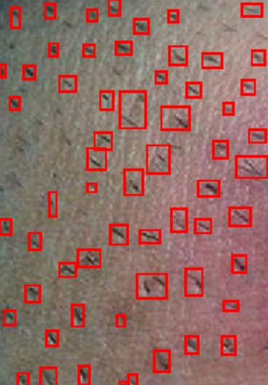
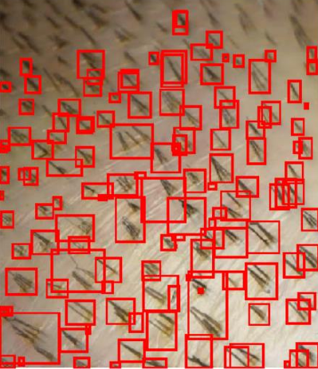
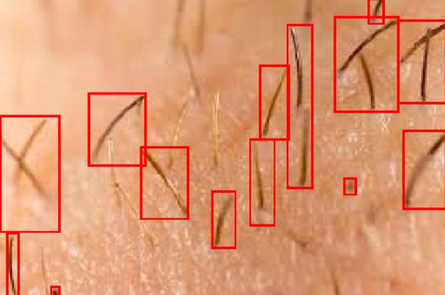
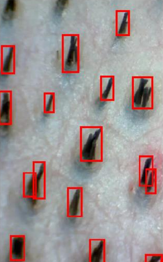

# Hair Root Detection Using Image Processing
This project is an implementation of hair root detection using various image processing techniques in MATLAB. The primary goal is to accurately detect and mark hair roots in given images, leveraging methods such as grayscale conversion, Gaussian filtering, Canny edge detection, and morphological processing.

## Overview
The project combines multiple image processing methods to detect hair roots in a given image. The approach is tested on several images, demonstrating effective detection in most cases.

## Project Structure
- Gray Scaling: Converts the input image to grayscale to reduce computational complexity and enhance processing speed.
- Gaussian Filter: Applies a Gaussian filter to smooth the image, removing noise and making hair roots more distinguishable.
- Canny Edge Detection: Detects edges in the image using the Canny method, which is known for its accuracy and double-thresholding technique.
- Morphological Operations: Applies dilation and closing operations to fill gaps between detected edges and enhance hair root visibility.
- Marking Hair Roots: Marks the detected hair roots with bounding boxes, making them clearly visible in the processed image.

## Results
                                                                                                                                 

